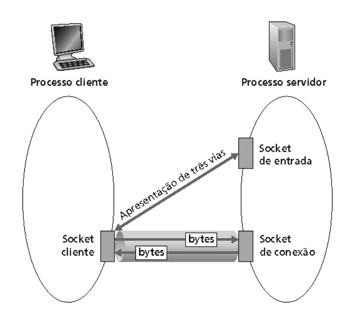

# Simples servidor Echo usando TCP/IP
 Basicamente o servidor fica num loop infinito esperando cliente querendo se conectar.
 Quando um cliente pede conexao o servidor cria um novo socket que vai ser usado como um "tubo de dados"

## Executando

```bash
python3 server.py
python3 client.py
```

